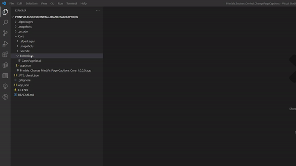
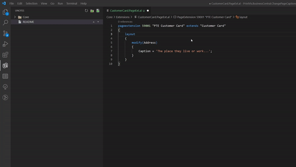

# Change Page Captions

This is an example of how to change captions in Business Central and PrintVis.

Simply clone this repository and use it as a start for a new project, or add Page Extensions to your existing Per Tenant Extension.

## Step 1 - Create a Page Extension or find an existing one

## Step 2 - Find the control you want to change

You can change the caption of every field, tab or action.

Fields and Tabs can be found in "Layout" and "Actions" can be found in (eh...) actions.

Intellisense will help you find the control very easily.
 
## TIP: Use F12 on the page you extend to see the controls

